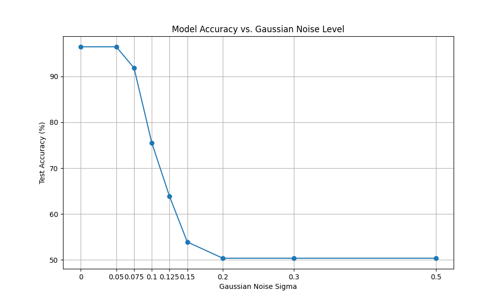
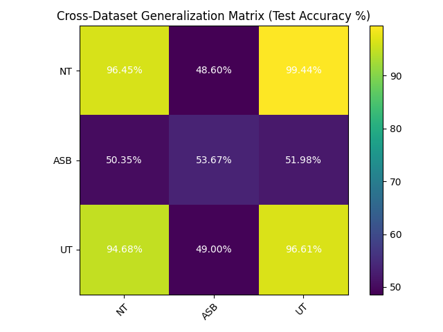

# OptML-CNN

CNN-based binary classification of fractures in grayscale microscopy images. This repository was created for the ETH Zurich course **Optimization and Machine Learning** and explores baseline training, hyperparameter optimization, robustness to Gaussian noise, and cross-dataset generalization.

The assignment defines one required task (Task 0) and six optional tasks. This repository does **not** implement every task. The status below reflects the code and result artifacts currently present in the project.

## Task status

| Task | Topic | Status | What is available |
|---|---|---|---|
| 0 | Baseline CNN | Implemented | Model and training scripts, saved NT models, training curves, and test results with/without augmentation |
| 1 | Hyperparameter optimization | Attempted / implemented in code | Optuna search and final-training code, study database, and a saved best NT model; the task-level written analysis and requested Optuna visualizations are incomplete |
| 2 | Gaussian-noise robustness | Implemented | Evaluation script, accuracy curve, and example corrupted images for nine noise levels |
| 3 | Interpretability | Not implemented | Placeholder task README only; no visualization code or results |
| 4 | Confusion-matrix analysis | Not implemented | Placeholder task README only; no analysis code or results |
| 5 | Cross-dataset generalization | Implemented | Training/evaluation code, three saved models, and a 3 x 3 generalization matrix |
| 6 | CNN vs. ViT | Not implemented | Placeholder task README only; no ViT or comparison code/results |

See [PROJECT_INSTRUCTIONS.md](PROJECT_INSTRUCTIONS.md) or [OptML_CNN_project.pdf](OptML_CNN_project.pdf) for the complete assignment specification. Each task folder also contains a short README describing the intended task and, where available, the approach taken.

## Dataset

The project uses 128 x 128 grayscale microscopy images from three experimental categories:

| Category | Samples |
|---|---:|
| ASB | 3,741 |
| NT | 1,407 |
| UT | 881 |

Each image belongs to one of two classes, representing the absence or presence of a fracture. The supplied train, validation, and test splits are stored under `data/processed/<category>/` as NumPy `.npz` files with `images` and `labels` arrays. Original MATLAB files are under `data/mmc1/`.

Dataset reference: Adrien Müller et al. (2021), *Machine Learning Classifiers for Surface Crack Detection in Fracture Experiments*.

## Implemented work and results

### Task 0: Baseline CNN

The baseline is a three-layer CNN:

```text
Conv2d(1, 32, 3) -> ReLU -> MaxPool2d
Conv2d(32, 64, 3) -> ReLU -> MaxPool2d
Conv2d(64, 128, 3) -> ReLU -> AdaptiveAvgPool2d
Linear(128, 2)
```

It was trained on the NT dataset for 150 epochs using Adam, a learning rate of `1e-3`, and a batch size of 32. Two runs compared standard training with random flips, rotations, and translations.

| NT experiment | Test accuracy | Training time |
|---|---:|---:|
| Without augmentation | 97.16% | 1 min 54.1 s |
| With augmentation | 96.81% | 5 min 31.0 s |

In these runs, augmentation increased training time and did not improve held-out accuracy.

Code and artifacts: [`tasks/task_0_baseline_cnn/`](tasks/task_0_baseline_cnn/)

### Task 1: Optuna hyperparameter search

The Optuna study targets minimum validation loss on NT. It runs 50 trials of 50 epochs and searches:

- learning rate: `1e-5` to `1e-2` on a log scale
- batch size: 8, 16, 32, 64, or 128
- convolution kernel size: 3, 5, or 7
- optimizer: Adam or SGD, including SGD momentum from 0 to 0.95
- data augmentation: enabled or disabled

After the search, the selected configuration is retrained for 100 epochs and saved. The study database and final checkpoint are included, but the requested optimization-history/parameter-importance figures and a completed written analysis are not currently present.

Code and artifacts: [`tasks/task_1_hyperparameter/`](tasks/task_1_hyperparameter/)

### Task 2: Robustness to Gaussian noise

The best model from Task 1 was evaluated on the NT test set after adding Gaussian noise at
`sigma = {0, 0.05, 0.075, 0.1, 0.125, 0.15, 0.2, 0.3, 0.5}`.

Accuracy remains high at low noise levels, then drops sharply between `sigma = 0.075` and `0.15`. At `sigma >= 0.2`, performance is approximately 50%, which is near chance for this binary task.



Code and artifacts: [`tasks/task_2_robustness/`](tasks/task_2_robustness/)

### Task 5: Cross-dataset generalization

Separate CNNs were trained on NT, ASB, and UT, then evaluated on all three test sets. Rows are training datasets and columns are test datasets.

| Train / Test | NT | ASB | UT |
|---|---:|---:|---:|
| NT | 96.45% | 48.60% | 99.44% |
| ASB | 50.35% | 53.67% | 51.98% |
| UT | 94.68% | 49.00% | 96.61% |

The NT- and UT-trained models transfer strongly between NT and UT but perform near chance on ASB. The ASB-trained model is near chance on all three test sets, indicating substantial dataset shift and/or an unsuccessful ASB training run.



Code and artifacts: [`tasks/task_5_cross_dataset/`](tasks/task_5_cross_dataset/)

## Setup

Python 3.10 is recommended.

```bash
python -m venv .venv
# Windows PowerShell
.venv\Scripts\Activate.ps1
pip install -r requirements.txt
```

PyTorch will use CUDA automatically when a compatible GPU and CUDA-enabled PyTorch installation are available; otherwise it falls back to CPU.

## Running the code

Run scripts from their corresponding task directory because result paths are relative to the current working directory. For example:

```powershell
cd tasks/task_0_baseline_cnn
python train.py
```

Before running Tasks 0, 1, 2, or the Task 5 training script, replace occurrences of the original local path
`C:/Code/Opt-ML/Project2` with the path to this repository. These scripts currently contain hard-coded paths and are therefore not portable without that adjustment. The Task 5 evaluation script resolves paths relative to the repository root:

```powershell
cd tasks/task_5_cross_dataset
python cross_dataset_generalization.py
```

Training and hyperparameter search can take several minutes or longer depending on the hardware. Existing checkpoints and plots are included under each implemented task's `results/` directory.

## Repository structure

```text
.
|-- data/
|   |-- mmc1/                         # Original MATLAB data
|   `-- processed/{ASB,NT,UT}/        # Train/validation/test NPZ files
|-- notebooks/
|   `-- nb_beginner_guide.ipynb       # Supplied data-loading guide
|-- tasks/
|   |-- task_0_baseline_cnn/          # Implemented
|   |-- task_1_hyperparameter/        # Implemented code; analysis incomplete
|   |-- task_2_robustness/            # Implemented
|   |-- task_3_interpretability/      # Not implemented
|   |-- task_4_confusion_matrix/      # Not implemented
|   |-- task_5_cross_dataset/         # Implemented
|   `-- task_6_cnn_vs_vit/            # Not implemented
|-- utils/export_dataset.py
|-- PROJECT_INSTRUCTIONS.md
|-- OptML_CNN_project.pdf
`-- requirements.txt
```
