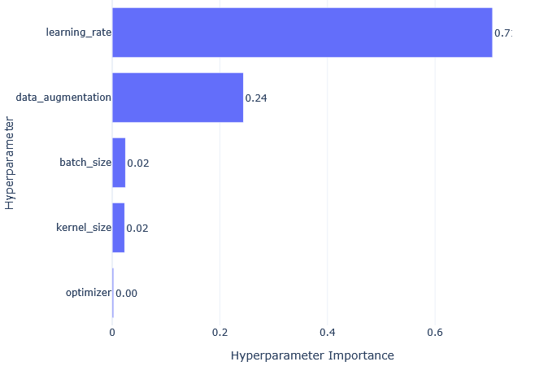
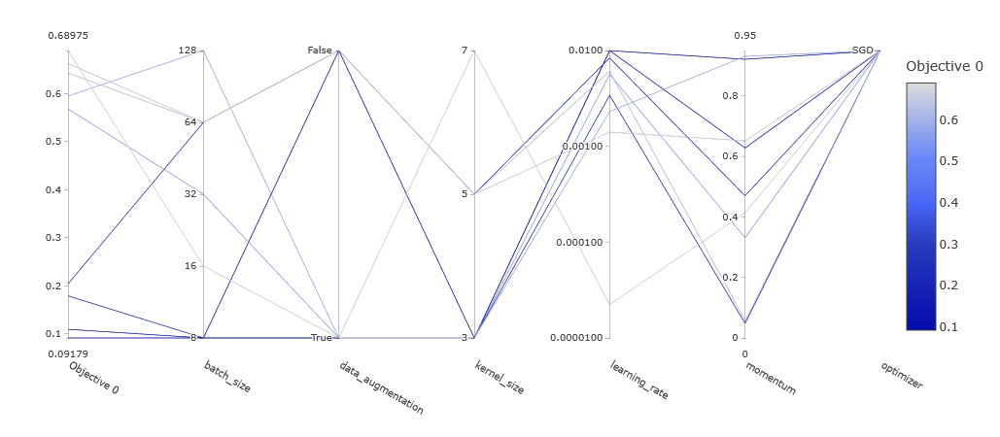

# Task 1: Hyperparameter Studies & Fine-tuning

## Objective
Systematically explore how hyperparameters affect model performance.

## Approach
*Describe whether you used Grid Search, Random Search, or Optuna*
I used Optuna for hyperparameter optimization, as the software seemed really capable and I liked the built-in validation capabilities using their Browser interface. For each trial, Optuna sampled a new hyperparameter configuration from a predefined search space, trained the CNN with this configuration, and evaluated it on the validation set using validation loss as the objective. Based on the results of previous trials, Optuna then guided the search toward more promising regions of the hyperparameter space. 

## Hyperparameters Explored
- Learning rate: [1e-5, 1e-2]
- Batch size: [8, 16, 32, 64, 128]
- Kernel size: [3, 5, 7]
- Optimizer: [Adam, SGD]
- Momentum (only for SGD): [0, 0.95]
- Data augmentation: [True, False]

## Results
Optuna results can be seen by typing "optuna-dashboard sqlite:///results/optuna_study.db --host 127.0.0.1 --port 50000" into bash/powershell inside the task_1_hyperparameter folder and then "http://127.0.0.1:50000" into your browser

*Add your results table/heatmap here*

## Best Configuration
*Describe the best hyperparameter combination found*
Best validation loss = 0.01706585101136524
Params = [learning_rate: 0.006578226274922781, batch_size: 8, kernel_size: 5, optimizer: Adam, data_augmentation: True]

## Files
- `grid_search.py` or `optuna_search.py` - Search script
- `results/` - Search results and visualizations
