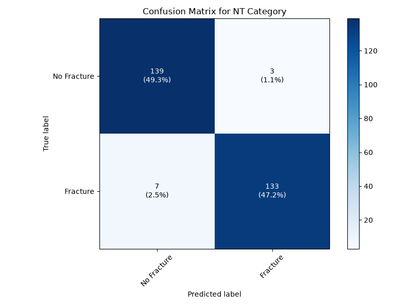

# Task 4: Confusion Matrix Analysis

## Objective
Perform detailed error analysis to understand model failures.

## Results

### Confusion Matrix
*Add confusion matrix figure here*

### Classification Metrics
| Class | Precision | Recall | F1-Score |
|-------|-----------|--------|----------|
| 0 | 95.21% | 97.89% | 96.53% |
| 1 | 97.79% | 95.00% | 96.38% |

## Error Analysis
*What do misclassified images have in common?*

Misclassified images are often ambigious for human observers. Common trends I noticed: Really thin fracture line, can be mistaken for random noise OR air pockets being mistaken for fractures 

## Suggestions for Improvement
*How could you reduce errors?*
Add an “unsure” category for low-confidence predictions.
Use a more complex CNN architecture to capture harder visual patterns.
Collect more labelled data, especially ambiguous borderline cases.
Use more test data for a more reliable evaluation.

## Files
- `analysis.py` - Analysis script
- `figures/` - Confusion matrix, misclassified examples
